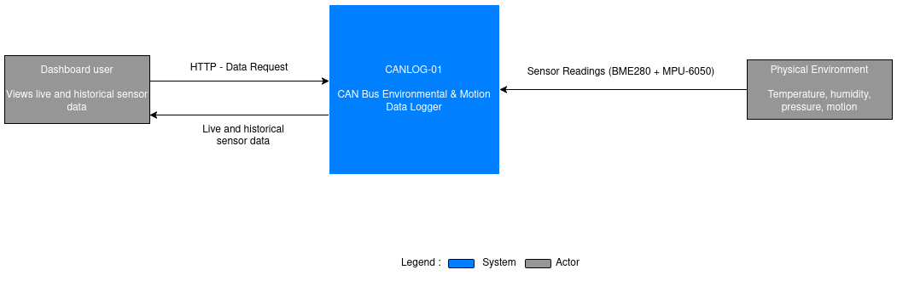
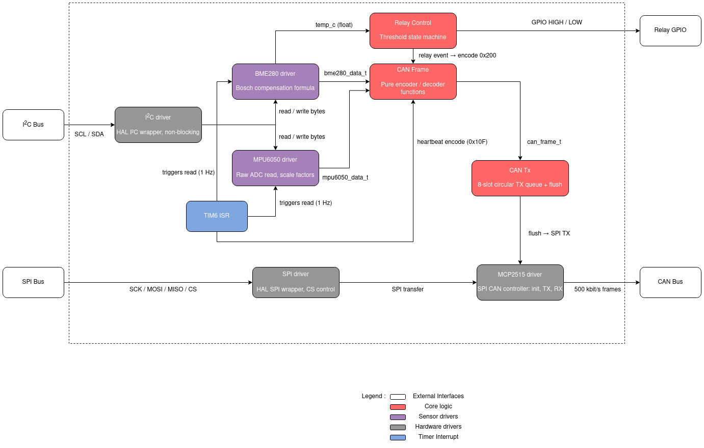
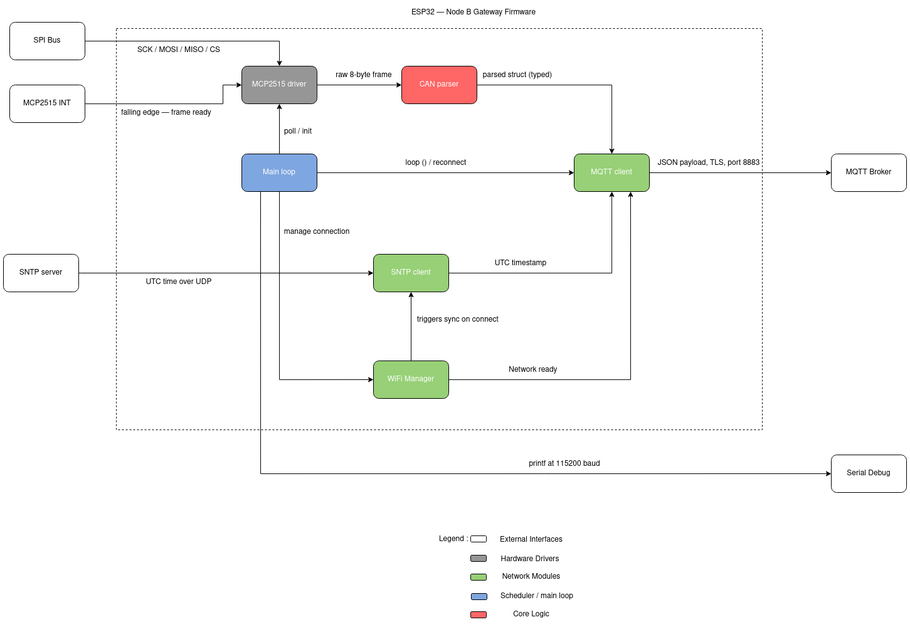
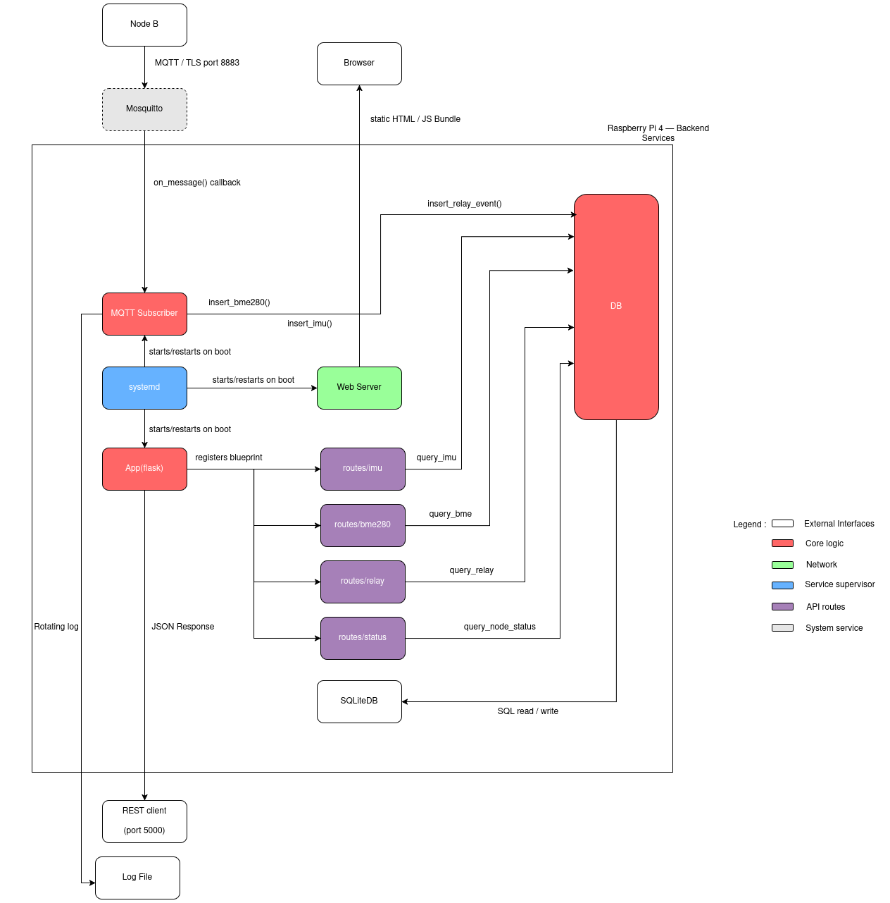

# System Architecture — CANLOG-01

> **Document status:** Draft v1.0 · Pre-development  
> **Last updated:** 2026-03  
> **Relates to:** `README.md`, `/docs/can_frame_spec.md`, `/docs/mqtt_topics.md`, `/diagrams/system_context.svg`

---

## Table of Contents

- [1. System Overview](#1-system-overview)
- [2. Four-Layer Architecture](#2-four-layer-architecture)
- [3. Data Flow — End to End](#3-data-flow--end-to-end)
- [4. Layer Detail](#4-layer-detail)
  - [4.1 Layer A — STM32 Firmware](#41-layer-a--stm32-firmware-node-a)
  - [4.2 Layer B — ESP32 Gateway](#42-layer-b--esp32-gateway-firmware-node-b)
  - [4.3 Layer C — Raspberry Pi Backend](#43-layer-c--raspberry-pi-backend)
  - [4.4 Layer D — Web Dashboard](#44-layer-d--web-dashboard)
- [5. Interface Boundaries](#5-interface-boundaries)
- [6. Key Design Decisions](#6-key-design-decisions)
- [7. Known Limitations](#7-known-limitations)
- [8. Future Improvements](#8-future-improvements)

---

## 1. System Overview

CANLOG-01 is a four-node embedded-systems pipeline. Physical sensors on a
STM32 microcontroller produce environmental and inertial measurements every
second. Those measurements travel over a CAN bus to an ESP32, which bridges
them to a local Wi-Fi network via MQTT over TLS. A Raspberry Pi running Linux
receives the MQTT messages, persists them to a SQLite database, and serves
them through a REST API to a browser-based live dashboard.



*Figure 1 — System context. The two external actors are the
physical environment feeding sensor data in, and the dashboard user reading
data out via a browser.*

The internal pipeline connecting all four nodes is shown below:

```
Physical world
      │
      ▼
[BME280 / MPU-6050]
      │  I²C 400 kHz
      ▼
[NUCLEO-G070RB]  ──── SPI 10 MHz ────►  [MCP2515] ──► CAN bus 500 kbit/s
      │                                                        │
      │ GPIO                                                   ▼
[5V relay]                                             [MCP2515] ──► [ESP32]
                                                                        │
                                                          MQTT/TLS  Wi-Fi
                                                                        │
                                                                        ▼
                                                          [Raspberry Pi 4]
                                                     Mosquitto · SQLite · Flask
                                                                        │
                                                              REST API (port 5000)
                                                                        │
                                                                        ▼
                                                           Browser dashboard
                                                              (port 8080)
```

---

## 2. Four-Layer Architecture

| Layer | Node | Language | Primary Responsibility |
|-------|------|----------|----------------------|
| **A — Firmware** | NUCLEO-G070RB | C99 (bare-metal) | Sensor acquisition, CAN frame TX, relay control |
| **B — Gateway** | ESP32 | Arduino C++ | CAN RX, MQTT publish over TLS, Wi-Fi management |
| **C — Backend** | Raspberry Pi 4 | Python 3 | MQTT subscribe, SQLite persistence, REST API |
| **D — Frontend** | Browser (served by Pi) | TypeScript / SolidJS | Live + historical data visualisation |

Each layer owns exactly one set of responsibilities and communicates with its
neighbours through a single defined interface. Layer A never touches Wi-Fi.
Layer B never touches the database. The boundaries are intentional — they
allow each layer to be tested independently and replaced without affecting
the others.

---

## 3. Data Flow — End to End

This section traces a single BME280 reading from silicon to browser pixel.
The same path applies to IMU data and relay events with minor variations.

### 3.1 Happy path — sensor reading

```
T+0.000s  TIM6 ISR fires on NUCLEO (1 Hz)
T+0.001s  I²C burst read: BME280 registers 0xF7–0xFC (6 bytes raw ADC)
T+0.002s  Bosch compensation formula applied → temp_c, humidity_pct, pressure_hpa
T+0.003s  can_encode_bme280() packs values into 8-byte CAN frame (ID 0x100)
T+0.003s  Frame enqueued in software TX queue (≤8 slots)
T+0.004s  Main loop calls can_tx_flush() → MCP2515 SPI load TX buffer sequence
T+0.005s  TJA1050 drives frame onto twisted-pair CAN bus at 500 kbit/s
          ────────────────────────── CAN bus ───────────────────────────
T+0.007s  Node B MCP2515 asserts INT → ESP32 SPI read RX buffer
T+0.008s  parse_bme280_frame() deserialises 8-byte payload → typed struct
T+0.009s  SNTP timestamp attached (UTC ISO-8601 string)
T+0.010s  JSON payload serialised: {"ts":"...","temp_c":22.45,"humidity_pct":48.1,...}
T+0.020s  PubSubClient.publish("canlog/node_a/bme280", payload, QoS 1) over TLS
          ──────────────── MQTT / TLS / Wi-Fi / TCP ────────────────────
T+0.050s  Mosquitto broker receives PUBLISH, delivers to local subscriber
T+0.051s  Python on_message() callback fires
T+0.052s  db.insert_bme280() writes row to sensor_bme280 SQLite table
          ─────────────── SQLite on Pi filesystem ──────────────────────
T+2.000s  Dashboard polls GET /api/bme280/latest (every 2 s interval)
T+2.001s  Flask queries SELECT * FROM sensor_bme280 ORDER BY id DESC LIMIT 1
T+2.002s  JSON response: {"ok":true,"data":[{...}]}
T+2.003s  SolidJS reactive signal updates → numeric card re-renders in browser
```

Total sensor-to-dashboard latency target: **≤ 3 seconds** (NFR-02).

### 3.2 Relay alert path

When temperature exceeds 40 °C:

1. `relay_update(temp_c)` called inside the 1 Hz ISR cycle.
2. State machine transitions `IDLE → ACTIVE`; relay GPIO asserted HIGH.
3. CAN frame 0x200 (state=ON, reason=TEMP_HIGH) enqueued and transmitted.
4. ESP32 publishes to `canlog/node_a/relay` at QoS 2 with `retain=true`.
5. Python subscriber writes row to `relay_events` table.
6. Dashboard alert log panel appends new row on next poll cycle.

Hysteresis of ±2 °C is applied in firmware: relay de-asserts only when
temperature drops below 38 °C, preventing rapid toggling near threshold.

### 3.3 I²C fault path

When a sensor does not ACK on the I²C bus:

1. `i2c_driver` returns error code; calling driver sets a fault flag.
2. `can_encode_fault()` builds frame 0x7FF with `fault_code` byte.
3. Heartbeat frame 0x10F `status_flags` bit for that sensor cleared (0 = not OK).
4. ESP32 receives both frames; publishes to `canlog/node_a/fault` (QoS 1).
5. Firmware does **not** hang or retry in a blocking loop.

### 3.4 Wi-Fi / MQTT reconnect path

1. ESP32 detects TCP disconnect from Mosquitto.
2. `WiFi_Manager` checks association; re-associates if needed.
3. `MQTT_Client` attempts reconnect after initial 2 s delay.
4. Each subsequent failure doubles the wait: 2 → 4 → 8 → 16 → 32 → 60 s (capped).
5. CAN frames continue to arrive and fill the MCP2515 hardware RX buffers (2-frame
   capacity) during the reconnect window. Frames beyond buffer capacity are lost —
   this is accepted behaviour for this project.
6. On reconnect, publishing resumes; no replay of missed frames.

---

## 4. Layer Detail

### 4.1 Layer A — STM32 Firmware (Node A)

**Hardware:** NUCLEO-G070RB (STM32G070RB, Cortex-M0+, 64 MHz, 128 KB flash, 36 KB RAM)

**Programming model:** Bare-metal C99. No RTOS. Single superloop with TIM6
interrupt driving all sensor acquisition at 1 Hz. No dynamic memory allocation
anywhere in the firmware (`malloc`/`free` never called).

**Component diagram:**



**Module structure:**

```
firmware/node_a/
├── Core/Src/
│   ├── main.c              # Superloop, peripheral init, ISR registration
│   ├── i2c_driver.c        # HAL I²C wrapper (non-blocking, poll-based)
│   ├── spi_driver.c        # HAL SPI wrapper (CS manual control)
│   ├── bme280_driver.c     # Bosch compensation, register map
│   ├── mpu6050_driver.c    # Register read, scale factor application
│   ├── mcp2515_driver.c    # SPI CAN controller: init, TX, RX
│   ├── can_frame.c         # Pure encoder/decoder functions (no I/O)
│   ├── can_tx.c            # 8-slot circular TX queue + flush
│   └── relay_control.c     # Threshold state machine (IDLE ↔ ACTIVE)
└── Core/Inc/
    └── config.h            # All compile-time constants (speeds, thresholds, IDs)
```

**Peripheral assignments:**

| Peripheral | Pin(s) | Config | Purpose |
|------------|--------|--------|---------|
| I2C1 | PB8 (SCL), PB9 (SDA) | 400 kHz fast mode | BME280 + MPU-6050 |
| SPI1 | PA5/PA6/PA7 + PB6 (CS) | 10 MHz, mode 0,0 | MCP2515 |
| bxCAN | PD0 (RX), PD1 (TX) | 500 kbit/s, normal | CAN bus |
| TIM6 | — | 1 Hz basic timer | Sensor acquisition tick |
| USART2 | PA2 (TX) | 115200 baud | Debug printf via ST-Link |
| GPIO | PB5 | Output, active-high | 5 V relay control |
| EXTI | PA9 | Falling edge | MCP2515 INT |

**CAN frame production rate:** 3 frames/second at steady state
(0x100 BME280 + 0x101 accel + 0x102 gyro) plus 1 heartbeat (0x10F).
Relay (0x200) and fault (0x7FF) frames are event-driven.

See [`/docs/can_frame_spec.md`](can_frame_spec.md) for full byte-layout of
every frame ID.

---

### 4.2 Layer B — ESP32 Gateway Firmware (Node B)

**Hardware:** ESP32 dev board (dual-core Xtensa LX6, 240 MHz, 4 MB flash, Wi-Fi 802.11 b/g/n)

**Component diagram:**



**Programming model:** Arduino framework (C++). Avoids `delay()` in production
paths; all timing via `millis()` comparisons. Wi-Fi credentials stored in
`provisioning.h` (gitignored), never hard-coded in source.

**Module structure:**

```
firmware/node_b/
├── node_b.ino              # Arduino entry point, setup(), loop()
├── can_parser.cpp/.h       # Pure CAN frame deserialiser (testable on host)
├── mqtt_client.cpp/.h      # PubSubClient wrapper, TLS, reconnect logic
├── wifi_manager.cpp/.h     # Connection, reconnect with exponential back-off
├── sntp_client.cpp/.h      # Time sync on boot, null-ts fallback
├── provisioning.h          # SSID, password (gitignored)
├── config.h                # Broker IP, port, topic prefixes, back-off limits
└── ca_cert.h               # Self-signed CA certificate (PEM as char[])
```

**Key behaviour constraints:**

- Accepts **all** CAN frame IDs (no hardware acceptance filter on MCP2515).
  Filtering is done in software by `can_parser.cpp`.
- MQTT publishes are **non-blocking** — uses `PubSubClient` with a 512-byte
  message buffer. Oversized payloads are truncated with a logged warning.
- SNTP sync attempted on boot with 30 s timeout. If sync fails,
  `ts` field in all JSON payloads is set to `null` and `sntp_ok = false`
  is noted in the serial log.
- TLS uses a self-signed CA certificate valid for 10 years. Certificate
  rotation is manual and out of scope for v1.0.

See [`/docs/mqtt_topics.md`](mqtt_topics.md) for full topic hierarchy and
JSON payload schemas.

---

### 4.3 Layer C — Raspberry Pi Backend

**Hardware:** Raspberry Pi 4 (2 GB RAM), Raspberry Pi OS 64-bit, 16 GB microSD.

**Component diagram:**



**Services (all managed by systemd, auto-start on boot):**

| Service | Unit file | Port | Description |
|---------|-----------|------|-------------|
| Mosquitto broker | `mosquitto.service` | 1883 (local), 8883 (TLS) | MQTT message broker |
| MQTT subscriber | `canlog-subscriber.service` | — | Persists messages to SQLite |
| REST API | `canlog-api.service` | 5000 | Flask/FastAPI JSON endpoints |
| Web server | `canlog-web.service` | 8080 | Serves built dashboard bundle |

**Backend module structure:**

```
backend/
├── mqtt_subscriber.py      # paho-mqtt client, on_message() router
├── db.py                   # SQLite3 connection, insert/query functions
├── app.py                  # Flask app, blueprint registration
├── routes/
│   ├── bme280.py           # /api/bme280/latest, /api/bme280/history
│   ├── imu.py              # /api/imu/latest, /api/imu/history
│   ├── relay.py            # /api/relay/events
│   └── status.py           # /api/status
├── schema.sql              # CREATE TABLE statements (migration script)
├── requirements.txt        # paho-mqtt, flask, python-dotenv, pytest
└── .env.example            # Template for broker address, DB path, log path
```

**SQLite schema summary:**

```sql
CREATE TABLE sensor_bme280 (
    id             INTEGER PRIMARY KEY AUTOINCREMENT,
    timestamp_utc  TEXT NOT NULL,
    node_id        TEXT NOT NULL,
    temp_c         REAL,
    humidity_pct   REAL,
    pressure_hpa   REAL,
    seq            INTEGER
);

CREATE TABLE sensor_mpu6050 (
    id             INTEGER PRIMARY KEY AUTOINCREMENT,
    timestamp_utc  TEXT NOT NULL,
    node_id        TEXT NOT NULL,
    ax_raw         INTEGER, ay_raw INTEGER, az_raw INTEGER,
    gx_raw         INTEGER, gy_raw INTEGER, gz_raw INTEGER,
    seq            INTEGER
);

CREATE TABLE relay_events (
    id             INTEGER PRIMARY KEY AUTOINCREMENT,
    timestamp_utc  TEXT NOT NULL,
    state          TEXT NOT NULL,   -- 'on' or 'off'
    reason         TEXT,
    temp_trigger_c REAL
);

CREATE TABLE node_status (
    id             INTEGER PRIMARY KEY AUTOINCREMENT,
    timestamp_utc  TEXT NOT NULL,
    node_id        TEXT NOT NULL,
    fw_version     TEXT,
    uptime_s       INTEGER,
    status_flags   INTEGER
);
```

**REST API endpoints:**

| Method | Endpoint | Description | Query params |
|--------|----------|-------------|--------------|
| GET | `/api/bme280/latest` | Most recent BME280 reading | — |
| GET | `/api/bme280/history` | BME280 readings over time window | `from`, `to` (ISO-8601), `limit` (default 500) |
| GET | `/api/imu/latest` | Most recent accel + gyro reading | — |
| GET | `/api/imu/history` | IMU readings over time window | `from`, `to`, `limit` |
| GET | `/api/relay/events` | Last N relay trigger/release events | `limit` (default 20) |
| GET | `/api/status` | Node heartbeat and system health | — |

All responses use the envelope: `{ "ok": true, "data": [...] }`.  
Response time target: **≤ 200 ms** for all endpoints (NFR-09).

**Logging:** Python `logging` module with `RotatingFileHandler`
(max 50 MB per file, 3 backups). All MQTT publishes and SQLite writes
are logged at `INFO` level. SQLite errors logged at `ERROR` level with
full traceback.

---

### 4.4 Layer D — Web Dashboard

**Served from:** Raspberry Pi port 8080 as a pre-built static bundle.  
**Framework:** SolidJS with TypeScript (strict mode). Built with Vite.  
**Charting:** Chart.js (line charts for historical data).

**Component structure:**

```
frontend/
├── src/
│   ├── App.tsx             # Root component, layout grid
│   ├── components/
│   │   ├── LiveCard.tsx    # Single numeric sensor value card
│   │   ├── HistoryChart.tsx# Chart.js wrapper, time-range selector
│   │   ├── RelayLog.tsx    # Alert event table (last 20 rows)
│   │   └── StatusBadge.tsx # Node heartbeat health indicator
│   ├── api.ts              # fetch() wrappers for all REST endpoints
│   └── types.ts            # TypeScript interfaces for API responses
├── .env.example            # VITE_API_BASE_URL=http://<pi-ip>:5000
├── package.json
└── vite.config.ts
```

**Polling behaviour:** `setInterval` at 2 s fires `GET /api/bme280/latest`
and `GET /api/imu/latest`. Historical chart data is fetched once on mount
and on time-range change. No WebSocket or server-sent events in v1.0 —
polling is sufficient given the 1 Hz sensor rate.

**Layout:** Single-page, two-column grid at ≥ 1024 px. Live cards row at
top, historical charts below, relay alert log at the bottom. Mobile layout
(single column) is a nice-to-have for v1.0.

---

## 5. Interface Boundaries

This section defines the exact contract at each layer boundary.
These are the points where bugs hide and where independent testing is
most valuable.

### 5.1 Boundary 1 — CAN bus (Layer A → Layer B)

**Medium:** Differential twisted pair, 500 kbit/s, 120 Ω termination at both ends.  
**Format:** Standard 11-bit CAN frames, DLC = 8 bytes, little-endian payload.  
**Spec:** [`/docs/can_frame_spec.md`](can_frame_spec.md)  
**Test point:** Logic analyser on CAN_H/CAN_L — PulseView decode confirms
frame ID, DLC, and payload bytes. Capture stored in
[`/debug_logs/can_frame_0x100.sr`](../debug_logs/).

### 5.2 Boundary 2 — MQTT / TLS (Layer B → Layer C)

**Medium:** Wi-Fi TCP/IP, port 8883, TLS 1.2+.  
**Format:** JSON UTF-8 string payloads. Topic hierarchy: `canlog/{node_id}/{data_type}`.  
**Spec:** [`/docs/mqtt_topics.md`](mqtt_topics.md)  
**Test point:** `mosquitto_sub --cafile ca.crt -h <pi-ip> -p 8883 -t canlog/#`
— manually verify JSON structure. Wireshark capture stored in
[`/debug_logs/mqtt_publish.pcapng`](../debug_logs/).

### 5.3 Boundary 3 — REST API (Layer C → Layer D)

**Medium:** HTTP/1.1 on localhost:5000.  
**Format:** JSON envelope `{ "ok": bool, "data": [...] }`.  
**Spec:** Section 4.3 above (endpoint table).  
**Test point:** `curl http://<pi-ip>:5000/api/bme280/latest` — verify
envelope and field names match TypeScript `types.ts` interfaces.

---

## 6. Key Design Decisions

This section records why the architecture is the way it is. Future maintainers
(and employers reviewing the repo) should understand the reasoning, not just
the outcome.

### 6.1 Why bare-metal, not an RTOS?

The sensor acquisition cycle is a simple 1 Hz tick with no concurrent task
contention. Adding FreeRTOS would introduce task scheduling overhead, stack
allocation per task, and semaphore complexity for a workload that fits cleanly
in a superloop. Bare-metal also produces more direct evidence of register-level
hardware knowledge, which is explicitly what the job-market targets for this
project require. An RTOS variant is noted as a potential Phase 4 stretch goal.

### 6.2 Why MCP2515 over the STM32's integrated bxCAN?

The STM32G070RB has a bxCAN peripheral, but CAN requires a physical transceiver
(TJA1050) regardless. The MCP2515 module is used on the ESP32 side (Node B)
because the ESP32 has no native CAN on the target dev board variant. Mirroring
the same MCP2515 driver on both nodes keeps the SPI interface symmetric and
reduces the number of distinct hardware abstractions to implement. The bxCAN
peripheral is still exercised for the CAN bus signalling via the TJA1050
transceiver on Node A.

### 6.3 Why a separate ESP32 for the Wi-Fi bridge?

The STM32G070RB has no Wi-Fi. Options considered: (a) UART AT-command Wi-Fi
module attached to STM32, (b) STM32 with external Wi-Fi, (c) separate ESP32
running Arduino. Option (c) was chosen because the ESP32 running Arduino
provides a complete and well-documented MQTT+TLS stack (PubSubClient +
WiFiClientSecure) that can be operational in hours rather than days. The
architectural separation also makes the CAN bus the clean interface between
the embedded domain and the network domain — a more realistic depiction of
automotive ECU-to-gateway topology.

### 6.4 Why Mosquitto on the Pi rather than a cloud broker?

Cloud IoT brokers (AWS IoT Core, Azure IoT Hub) require account setup,
certificate provisioning workflows, and introduce external dependencies that
complicate a reproducible portfolio demonstration. A local Mosquitto broker
is fully self-contained, works without internet access, and demonstrates the
same MQTT protocol skills. Cloud migration is a documented future improvement.

### 6.5 Why SQLite rather than PostgreSQL or InfluxDB?

The data rate is 3 rows/second across two tables — well within SQLite's
write throughput on a Raspberry Pi 4 with a Class 10 microSD. SQLite
requires no separate server process, no configuration, and the database
file is trivially portable. For the query patterns used (latest row +
time-window range scan with a `LIMIT`), SQLite with an index on
`timestamp_utc` is sufficient. InfluxDB would be the natural upgrade path
if sub-second time-series queries or long retention windows became a
requirement.

### 6.6 Why polling rather than WebSockets on the dashboard?

The sensor update rate is 1 Hz. A 2-second polling interval wastes at most
one sensor cycle of freshness, which is acceptable. WebSockets add a
persistent connection that complicates the backend (requires an async server
or a separate WebSocket handler) for a marginal latency improvement. Polling
also survives network interruptions transparently without reconnect logic in
the frontend. WebSocket upgrade is noted as a future improvement.

### 6.7 Why SolidJS rather than React?

SolidJS compiles to fine-grained reactive DOM updates with no virtual DOM
diffing. For a dashboard that updates live numeric values at 2 Hz, the absence
of reconciliation overhead is a genuine advantage. The compiled bundle is also
significantly smaller than a comparable React app, which matters when serving
from a Raspberry Pi. Plain TypeScript with vanilla `fetch` is an equally valid
choice and is noted as a fallback if SolidJS introduces blocking friction during
Phase 3.

---

## 7. Known Limitations

**CAN frame loss during MQTT reconnect.** The MCP2515 has a 2-frame hardware
RX buffer. During a Wi-Fi or MQTT reconnect event (up to 60 s back-off cap),
arriving CAN frames overflow the buffer and are silently dropped at the
hardware layer. This is accepted for v1.0 — the SQLite data will have gaps
during reconnect windows.

**No replay or buffering on the ESP32.** The ESP32 does not queue undelivered
MQTT messages during disconnects. Once the hardware buffer overflows, those
sensor readings are permanently lost. A FIFO in PSRAM with replay-on-reconnect
would address this.

**SQLite on microSD is a single point of failure.** If the microSD card
corrupts (possible with a hard power-cut), all historical data is lost.
WAL mode is enabled to reduce corruption risk, but no backup strategy
exists in v1.0.

**Self-signed TLS certificate.** The CA cert embedded in the ESP32 firmware
is valid for 10 years but is not trusted by any public root store. Manual
certificate rotation is required if the key is ever compromised.

**No authentication on the REST API or dashboard.** Any device on the same
network can read sensor data and see relay events. Authentication is explicitly
out of scope for v1.0.

**Dashboard polling causes data gaps during API restarts.** If the Flask
process restarts (e.g. after a systemd crash loop), the dashboard will
display stale data until the next successful poll. No error state is shown
to the user in v1.0.

---

## 8. Future Improvements

| ID | Improvement | Unlocks |
|----|-------------|---------|
| FUT-01 | Replace polling with Server-Sent Events or WebSocket on dashboard | Sub-second display latency |
| FUT-02 | ESP32 PSRAM frame queue + replay on MQTT reconnect | No sensor data loss during disconnects |
| FUT-03 | Migrate to InfluxDB + Grafana | Sub-second queries, retention policies, richer visualisation |
| FUT-04 | Migrate to AWS IoT Core or Azure IoT Hub | Production PKI, multi-device scale, cloud retention |
| FUT-05 | FreeRTOS port of STM32 firmware | Demonstrate RTOS task + semaphore skills |
| FUT-06 | Yocto custom Linux image for Raspberry Pi | Custom BSP, minimal footprint, production OS skills |
| FUT-07 | PCB design replacing breadboard wiring | Reduced noise, production-ready hardware artefact |
| FUT-08 | Dashboard authentication (JWT or session cookie) | Secure multi-user access |
| FUT-09 | CAN FD upgrade (500 kbit/s arbitration + 2 Mbit/s data) | Higher throughput, modern automotive standard |
| FUT-10 | OTA firmware update via MQTT (ESP32 + STM32 bootloader) | Field-updatable nodes without physical access |

---

*CANLOG-01 · Architecture Document · v1.0 · MIT License*
